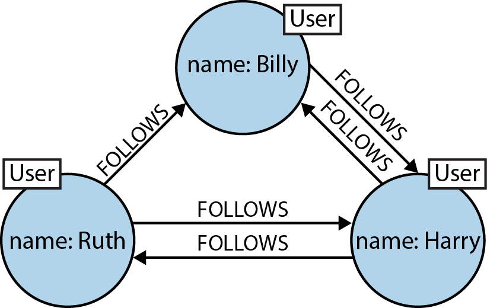
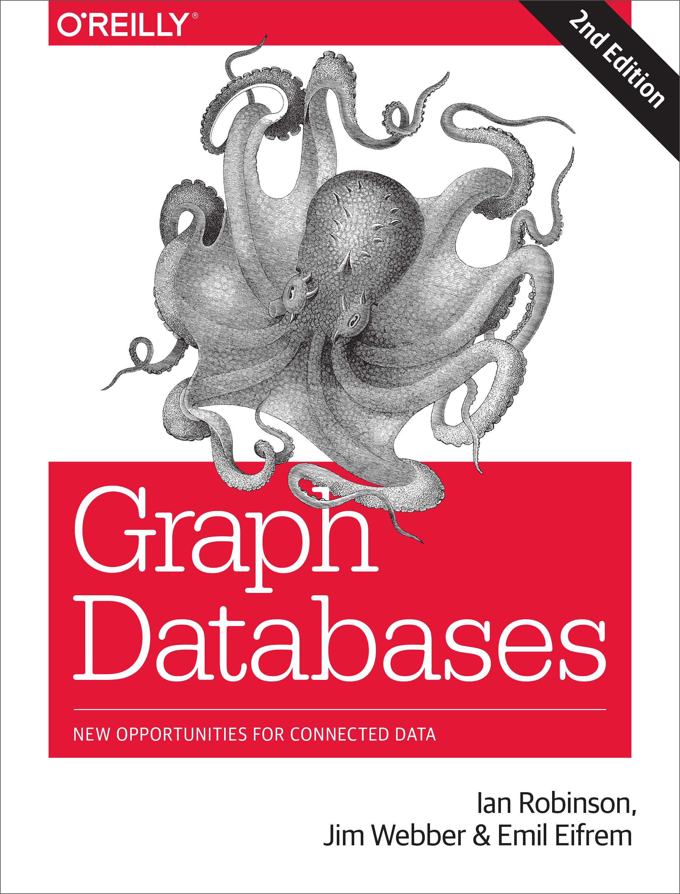
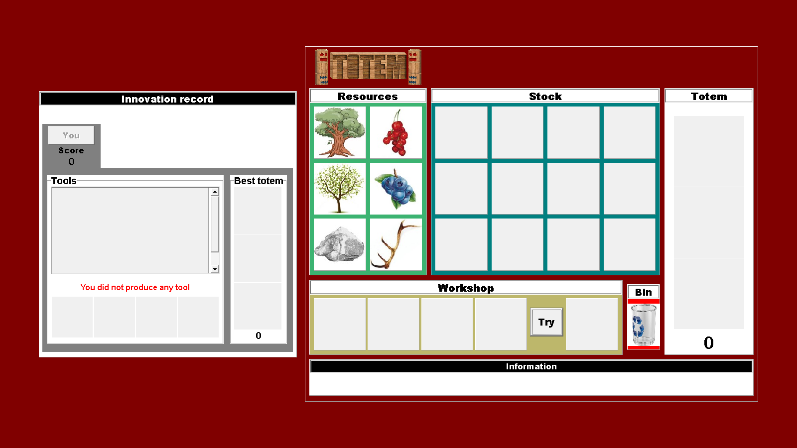
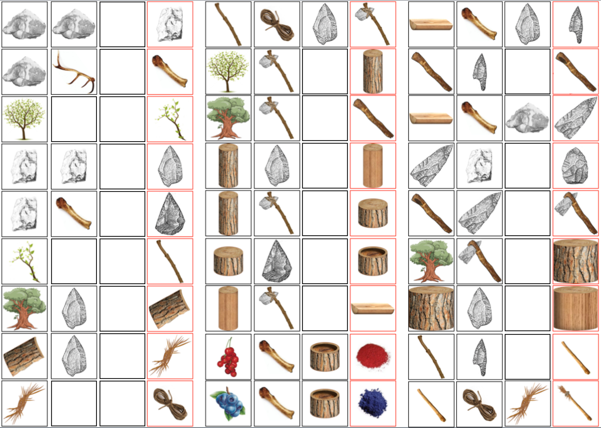
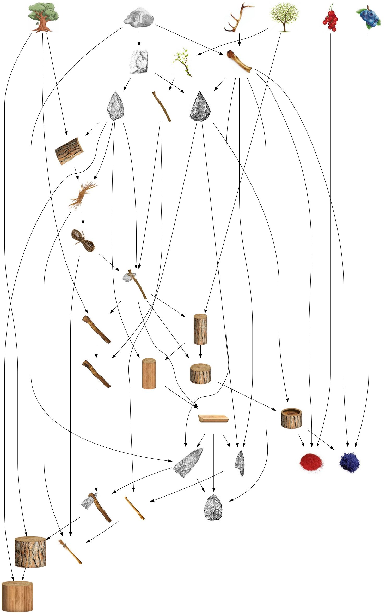
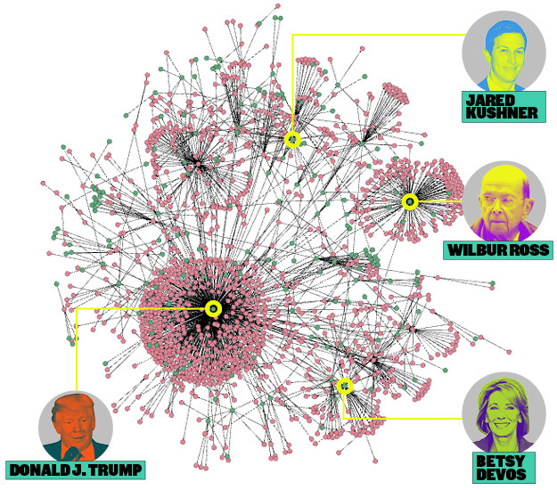
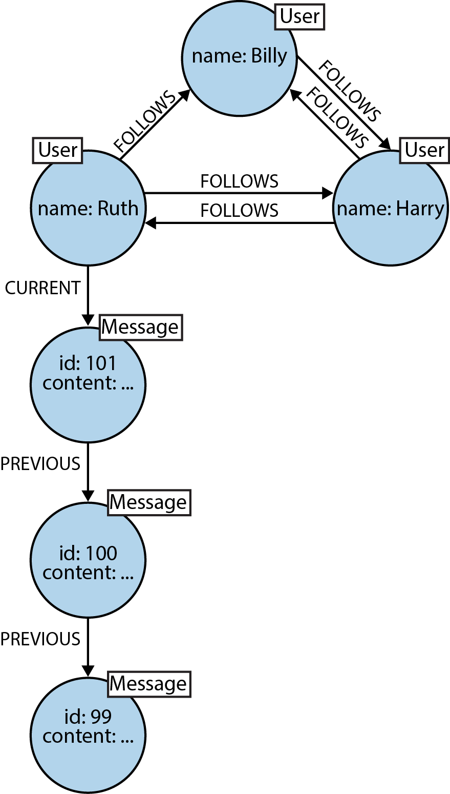
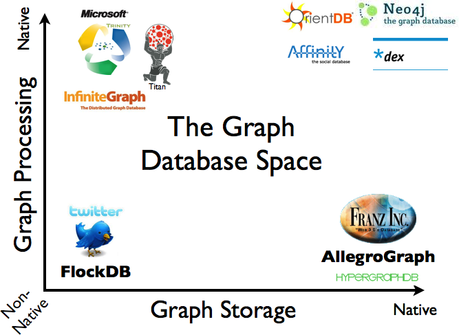
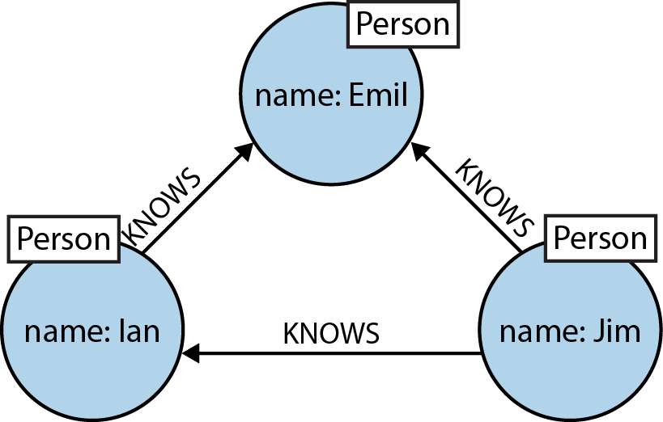
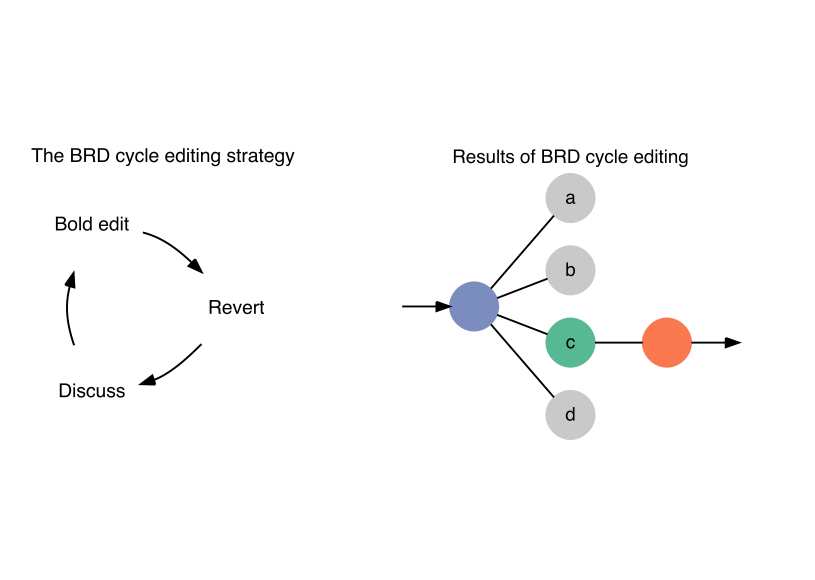

# Outline

1. Graph problems and graph databases
2. Neo4j + Cypher basics
3. Graph modeling in python with py2neo
4. Building a simple recommender system

# What's a graph problem?

> Graphs are everywhere, they’re eating the world, and there’s no going back.



# Graph databases



# Graph problems

- Social networks
- Search engines
- Geospatial data
- Meta management
- [Fraud detection](https://neo4j.com/graphgist/9d627127-003b-411a-b3ce-f8d3970c2afa)
- _Investigative journalism_
- _Recommendation systems_
- _Science?_

# Totems



# Recipes



# Landscape



# The Panama Papers

- [ICIJ](https://panamapapers.icij.org/)
- [Neo4j Blog](https://neo4j.com/blog/analyzing-panama-papers-neo4j/)
- [Linkurious](https://linkurio.us/blog/panama-papers-how-linkurious-enables-icij-to-investigate-the-massive-mossack-fonseca-leaks/)


# TrumpWorld

- [BuzzFeed](https://www.buzzfeed.com/johntemplon/help-us-map-trumpworld?utm_term=.samWBDAzW#.jdmamByja)
- [Neo4j Blog](https://neo4j.com/blog/buzzfeed-trumpworld-dataset-neo4j/)



# Why use a graph database?

- Performance (index free adjacency)
- Flexibility (schema-free)
- Intuitiveness (Cypher query language)

# Graph modeling



# Kinds of graph databases



# Neo4j + Cypher

`(emil)<-[:KNOWS]-(jim)-[:KNOWS]->(ian)-[:KNOWS]->(emil)`



# OrientDB

```sql
-- SQL
SELECT *
FROM Employee A, City B
WHERE A.city = B.id
AND B.name = 'Rome'
```

```sql
-- OrientDB SQL
SELECT * FROM Employee WHERE city.name = 'Rome'
```

```
// cypher
MATCH (A:Employee) -[:LIVES_IN]-> (B:City {name: 'Rome'})
RETURN A, B
```

# Cypher variables

```
(emil)<-[:KNOWS]-(jim)-[:KNOWS]->(ian)-[:KNOWS]->(emil)

(emil:Person)
  <-[:KNOWS]-(jim:Person)
  -[:KNOWS]->(ian:Person)
  -[:KNOWS]->(emil)

()<-[:KNOWS]-(jim)-[:KNOWS]->()-[:KNOWS]->()

(emil:Person {name: 'Emil'})
  <-[:KNOWS]-(jim:Person {name: 'Jim'})
  -[:KNOWS]->(ian:Person {name: 'Ian'})
  -[:KNOWS]->(emil)
```

# Cypher summary

## Nodes and edges

- Nodes: `(var:Label {property: value})`
- Edges: `-[var:LABEL {property: value}]->`

## [Clauses](https://neo4j.com/docs/developer-manual/current/cypher/clauses/)

```
MATCH, RETURN, CREATE, MERGE, DELETE
```

## Subclauses

```
MATCH + WHERE
RETURN + ORDER BY (+ LIMIT)
```

# Cypher queries

> Find all of Jim's friends who know each other.

```
MATCH (a:Person {name:'Jim'}),
      (a)-[:KNOWS]->(b)-[:KNOWS]->(c),
      (a)-[:KNOWS]->(c)
RETURN b, c
```

# Neo4j

```bash
$ brew install neo4j
$ neo4j start
# open browser to localhost:7474
# login and set password
# record password somewhere
$ export NEO4J_PASSWORD=gefilte-fish
```

# Basic Cypher commands

```
// create a single node
CREATE (pierce:Pythonista {screen_name: 'pedmiston'})
```

```
// create nodes and relationships
MATCH (pierce:Pythonista {screen_name: 'pedmiston'})
CREATE (dan:Pythonista {screen_name: 'dwieeb'}),
       (madpy:Meetup {topic: 'python'}),
       (pierce) -[:ORGANIZES]-> (madpy),
       (dan) -[:ORGANIZES]-> (madpy)
```

# Getting data into Neo4j

1. Enter data manually with the [`CREATE`](https://neo4j.com/docs/developer-manual/current/cypher/clauses/create/) clause and cypher scripts.
2. Load plaintext data with [`LOAD CSV`](https://neo4j.com/developer/guide-importing-data-and-etl/) or `neo4j-import`.
3. Build the data in python with [`py2neo`](http://py2neo.org/v3/).

# Creating a node

```python
from os import environ
from py2neo import Graph, Node

graph = Graph(password=environ['NEO4J_PASSWORD'])
me = Node('Person', first_name='Pierce')
graph.create(me)
```

# Creating a relationship

```python
from py2neo import Relationship

parker = Node('Parent', first_name='Parker')
father_of = Relationship(me, 'FATHER_OF', parker)
graph.create(father_of)  # creates node for Parker too
```

# Graph queries

```python
import pandas

q = """
MATCH (me:Person {first_name: 'Pierce'}),
      (me) -[:FATHER_OF]-> (child)
RETURN child
"""
children = pandas.DataFrame(graph.data(q))
assert len(children) == 1, 'whoops!'
```

# Wikipedia editing cycle as an evolutionary strategy



# pywikibot

```python
import pywikibot
import pandas

def get_revisions(title):
    """Retrieve all versions of a Wikipedia article."""
    site = pywikibot.Site('en', 'wikipedia')
    page = pywikibot.Page(site, title)
    revisions = page.revisions(content=False)
    records = [revision.__dict__ for revision in revisions]
    table = pandas.DataFrame.from_records(records)
    table.insert(0, 'title', title)
    table.rename(columns=lambda x: x.lstrip('_'),
                 inplace=True)
    return table
```

# Nodes for each version

```python
# Create nodes for every version of an article
revisons = get_revisions('Splendid fairywren')
texts = {sha1: Node('Wikitext', sha1=sha1)
         for sha1 in revisions.sha1.unique()}
```

# Map revids to sha1s

```python
# Create a dict of revid -> sha1
sha1s = (revisions[['revid', 'sha1']]
                  .set_index('revid')
                  .squeeze()
                  .to_dict())
```

# Creating edits as relationships

```python
edits = []
for rev in revisions.itertuples():
  # Each rev has a revid, a sha1, and a parent revid
  child = texts[rev.sha1]
  parent_sha1 = sha1s[rev.parent_id]
  parent = texts[parent_sha1]
  edit = Relationship(parent, 'EDIT', child)
  edits.append(edit)
```

# wikitree.py demo

```bash
$ ./wikitree.py graph 'Splendid fairywren'
```

```
MATCH (article:Article {title: 'Splendid fairywren'}),
      (root:Revision {type: 'root'}) -[:TO]-> (article),
      (root) -[:CONTAINS]-> (first:Wikitext),
      (root) -[:NEXT*..50]-> (revision:Revision),
      (revision) -[:CONTAINS]-> (subsequent:Wikitext)
RETURN root, first, subsequent
```

# [google_survey](https://github.com/madison-python/google-survey.git)

```
setup.py         # installable with pip
google_survey/
  __init__.py    # makes this a package
  __main__.py    # run with "python -m google_survey"
  responses.py   # download survey responses
  tidy.py        # tidy survey responses
  questions.py   # scrape question data
  css.py         # google forms css selectors
  all.py         # combine responses and questions
```

# setup.py

```python
from setuptools import setup

setup(
    name='google_survey',
    packages=['google_survey'],
    install_requires=[
        'gspread', 'oauth2client', 'pandas', 'fire',
    ],
)
```

# Installing with pip

```bash
$ virtualenv --python python3 ~/.venvs/madpy
$ source ~/.venvs/madpy/bin/activate
(madpy)$ pip install -e git+git://github.com/madison-python/google-survey.git#egg=google_survey
```

# Getting survey responses

```yaml
---
# contents of madpy-survey-info.yaml
sheet_name: madpy-habits-responses
creds_file: madpy-service-account-key.json
survey_url: https://docs.google.com/forms/d/e/1FAIpQLScnwwfdLN_iUNaZEyks62Y_2DO8qADWGZU0ykVoWSRcnDSkfA/viewform
```

```python
# using google survey in scripts
import google_survey
responses = google_survey.get('madpy-habits-survey.yaml')
```

# Set index to filter by question

```python
# Set question_id as index to allow
# queries like: responses.ix['q0']
responses.set_index('question_id', inplace=True)
```

# Create nodes for all Madpy Pythonistas

> Q0. What's your screen name?

```python
pythonistas = {}
screen_names = responses.ix['q0', ['person_id', 'response']]
for _, (person_id, screen_name) in screen_names.iterrows():
    pythonista = Node('Pythonista', screen_name=screen_name)
    pythonistas[person_id] = pythonista
```

# Dict comprehension

```python
pythonistas = {
  person_id: Node('Pythonista', screen_name=screen_name)
  for _, (person_id, screen_name) in
  responses.ix['q0', ['person_id', 'response']].iterrows()
}
```

# Create nodes for editors and relationships for editor preferences

> Q1. You're about to start a new python project. What text editor do you open up?

```python
editors = {}
prefs = []
responses = responses.ix['q1', ['person', 'response']]
for _, (person_id, editor) in editor_responses.iterrows():
    pythonista = pythonistas[person_id]
    editor = editors.setdefault(editor,
                                Node('Editor', name=editor))
    prefs.append(Relationship(pythonista, 'TYPES_IN', editor))
```

# Building a recommendation system

> Find people similar to Dan through the packages they both like, and then recommend the packages they like that Dan doesn't like.

```
MATCH (dan:Pythonista {screen_name: 'dwieeb'}),
      (dan) -[:LIKES]-> (known_package),
      (known_package) <-[:LIKES]- (similar_person),
      (similar_person) -[:LIKES]-> (other_package)
WHERE NOT (dan) -[:LIKES]-> (other_package)
RETURN other_package
```

# Simple Flask app

```python
from flask import Flask, request, render_template
from py2neo import Graph

app = Flask(__name__)
graph = Graph(password=environ['NEO4J_PASSWORD'])

@app.route('/', methods=['GET', 'POST'])
def madpy_habits():
    screen_name = None
    recommendations = None
    if request.method == 'POST':
        screen_name = request.form['screen_name']
        recommendations = get_recommendations(screen_name)
    return render_template('you_might_like.html',
                           screen_name=screen_name,
                           recommendations=recommendations)
```

# you_might_like.html

```html
<h1>Madpy Recommendation Engine</h1>

<form method=POST>
  Enter your screen name to see your recommendations.<br>
  <input type="text" name="screen_name">
  <input type="submit" value="Go"><br>
</form>


  <p><em>{{ screen_name }}</em>, you might also like:</p>
  {{ recommendations | safe }}

```

# get_recommendations

```python
def get_recommendations(screen_name):
    recommendations = pandas.DataFrame(graph.data("""
    MATCH (member:Pythonista {screen_name: {screen_name}}),
          (member) -[:LIKES]-> (known_package),
          (known_package) <-[:LIKES]- (similar_person),
          (similar_person) -[:LIKES]-> (other_package)
    WHERE NOT (member) -[:LIKES]-> (other_package)
    RETURN known_package.name AS known_package,
           similar_person.screen_name AS similar_person,
           other_package.name AS recommendation
    """, screen_name=screen_name))
    return recommendations.to_html()
```

# End!

Pierce Edmiston  
pierce.edmiston@gmail.com  
@pedmistor  
github.com/pedmiston  
github.com/madison-python/graph-data  
